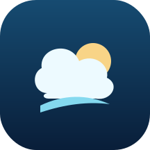
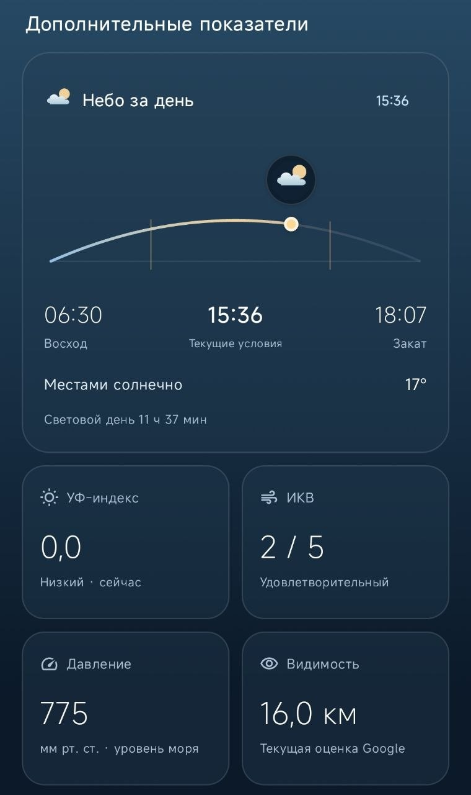

  

<h1 align="center">Небосвод</h1>

  Нативное Android-приложение погоды на Kotlin и Jetpack Compose. 
  Портфолио-проект: прогноз, офлайн-кэш, виджет, качество воздуха и карта осадков без пользовательских API-ключей.

  <a href="https://github.com/NikitaCreatorDeveloper/nebosvod/releases/download/v1.0.0-rc.3/Nebosvod-1.0.0-rc.3.apk"><strong>Скачать подписанный APK</strong></a>
  ·
  <a href="https://github.com/NikitaCreatorDeveloper/nebosvod/releases/tag/v1.0.0-rc.3">Релиз</a>
  ·
  <a href="INSTALLATION.md">Установка и проверка</a>
  ·
  <a href="TESTING.md">Тестирование</a>

> **Статус:** функционально завершённый portfolio snapshot. Активная разработка новых функций остановлена; возможны только существенные исправления совместимости, безопасности и распространения.

## Возможности

- текущая погода, «ощущается как», температура, ветер, влажность и осадки;
- почасовой прогноз и прогноз на 10 дней;
- УФ-индекс, ИКВ, восход/закат и дополнительные показатели;
- сохранённый прогноз после закрытия приложения и перезапуска процесса;
- настраиваемый Android-виджет;
- города, единицы измерения, светлая/тёмная тема;
- нативная карта: OpenStreetMap + наблюдаемый радар осадков RainViewer;
- работа без личных API-ключей и без собственного сервера приложения.

## Интерфейс

<table>
  <tr>
    <td align="center"> Главный экран</td>
    <td align="center"> Почасовой и 10-дневный прогноз</td>
    <td align="center"> Дополнительные показатели</td>
  </tr>
</table>

Галерея показывает provider-neutral части интерфейса той же линии приложения. В публичной сборке <code>1.0.0-rc.3</code> сетевые источники — Open-Meteo, RainViewer и OpenStreetMap.

## Источники данных

| Функция | Публичный источник |
|---|---|
| Текущая погода, часы и дни | Open-Meteo Forecast API |
| Качество воздуха | Open-Meteo Air Quality / CAMS ENSEMBLE |
| Географическая подложка | OpenStreetMap |
| Осадки на карте | RainViewer Weather Maps API, последний доступный прошедший радарный кадр |

Google Weather и OpenWeather не используются публичным runtime. RainViewer не гарантирует глобальное радарное покрытие: отсутствие кадра не означает отсутствие осадков. Nowcast в этой версии не заявляется.

## Технологии

- Kotlin, Jetpack Compose и Material 3;
- ViewModel + StateFlow;
- Kotlin Coroutines;
- OkHttp;
- Preferences DataStore;
- WorkManager;
- RemoteViews для виджета;
- нативный рендер карты без WebView.

Подробности: [архитектура](ARCHITECTURE-RU.md) и [аудит публичных провайдеров](PUBLIC-MAP-PROVIDER-AUDIT.md).

## Проверено

Финальный кандидат проходил локальную проверку исходников, APK и Android runtime:

| Проверка | Результат |
|---|---:|
| JUnit | **31 PASS / 0 FAIL** |
| Android Lint | **0 errors / 41 warnings** |
| Source/static checks | **304 PASS** |
| Regression checks | **68 PASS** |
| PUBLIC source/config/APK checks | **359 PASS** |
| Emulator runtime checks | **11 PASS** |
| Debug build / release compile | **PASS** |

Полный краткий отчёт и ограничения: [TESTING.md](TESTING.md). Исходный Kotlin-код намеренно не опубликован, поэтому публичный GitHub workflow проверяет целостность витрины, а не изображает повторный запуск закрытого test suite.

## Скачать и проверить

Текущий публичный артефакт: **Небосвод 1.0.0-rc.3** (<code>versionCode 102</code>, package <code>app.nebo.weather.public</code>).

- APK: [Nebosvod-1.0.0-rc.3.apk](https://github.com/NikitaCreatorDeveloper/nebosvod/releases/download/v1.0.0-rc.3/Nebosvod-1.0.0-rc.3.apk)
- SHA-256: <code>02d685092ea0dddce113281c6f9951ca2a313c839d11008644820a7adf90a160</code>
- релиз содержит также <code>SHA256SUMS.txt</code> и публичный <code>publisher-certificate.pem</code>.

APK **подписан**. Подпись Android и репутация Google Play Protect — разные механизмы: при прямой установке с GitHub Play Protect всё ещё может показать предупреждение о ранее не проверенном разработчике. Текущий статус и правильный путь регистрации описаны в [INSTALLATION.md](INSTALLATION.md). Отключать Play Protect для распространения проекта не требуется и не рекомендуется.

## Privacy

У приложения нет собственного сервера, рекламы, аналитики и автоматической отправки crash-отчётов. Запросы идут напрямую к Open-Meteo, RainViewer, OpenStreetMap и системному Android Geocoder. Подробно: [PRIVACY.md](PRIVACY.md).

## Лицензии и область распространения

Собственное приложение, документация и официальные бинарные релизы регулируются [Nebosvod Portfolio License](LICENSE). Разрешено скачивание, установка и использование официального неизменённого APK для личного, учебного и иного некоммерческого ознакомления с проектом.

Сторонние библиотеки и погодные/картографические данные остаются под собственными лицензиями и условиями: [THIRD_PARTY_NOTICES.md](THIRD_PARTY_NOTICES.md). Эта публичная сборка позиционируется как **некоммерческий portfolio/showcase release**, что соответствует выбранным бесплатным публичным источникам данных.

## Репозиторий

Это намеренно **docs + distribution repository**. Kotlin source, AAB, приватный signing key, пароли и локальные настройки здесь не публикуются.

Дополнительные документы: [начало работы](GETTING-STARTED.md) · [источники](SOURCES.md) · [распространение](DISTRIBUTION.md) · [release notes](RELEASE-NOTES.md).

---

Weather data by [Open-Meteo](https://open-meteo.com/) · Air quality: CAMS ENSEMBLE · Weather data by [RainViewer](https://www.rainviewer.com/) · © [OpenStreetMap contributors](https://www.openstreetmap.org/copyright).
